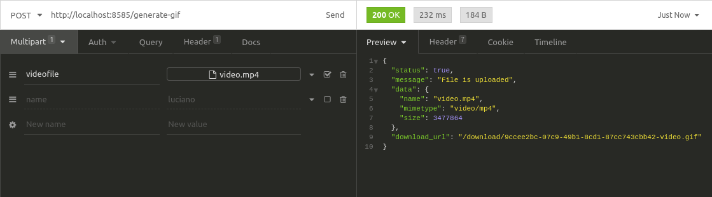

# gif-gen-api

Main goal is create a api that allows generate gifs from video

## Installation

You have to nstall those guys:

ffmpeg:

```bash
sudo apt install ffmpeg
```

nodejs:

check how to do that here: https://nodejs.org/en/download/package-manager/

OR if you prefer you can use docker:

from src folder run:

```bash
docker build -t gif-gen-api -f ../docker/Dockerfile .
docker container run -p 8585:8585  gif-gen-api
```

## Usage

Just do a post to /generate-gif passing the video on field "videofile" then you will receive a link to download your gif ;)
take a look:



as you can see on this example below i got a good result:


## Contributing
Pull requests are welcome. For major changes, please open an issue first to discuss what you would like to change

## License
[MIT](https://choosealicense.com/licenses/mit/)